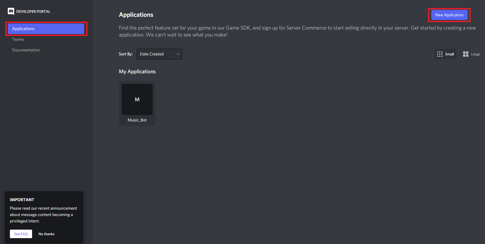

# MusicBot

MusicBot is a discord-bot playing music from youtube-url. You can make a playlist and handle it.
 + **Play the music** by adding to list.
 + **Show** the list and **handle** it.

# Getting Started

There are two prerequisite for MusicBot.

Install and invite Discord-Bot.

## Setting Discord Bot


1. Go to https://discord.com/ and Select __Developers__
   
2. After selecting __Application__ at the top left, click __New Application__ on the right. 
3. Enter your name and Click __Create__ to create the application. 
4. After selecting __Bot__ at the left, click __Add Bot__ on the right.
5. selecting __OAuth2 -> URL Generator__ at the left, check the box __bot__ and __Administrator__. 
6. Copy the address and invite it to your own channel. 
7. Also you can check your token at here. 
   
## Installation

1. Clone the repo
   ```sh
   git clone http://khuhub.khu.ac.kr/2018102118/Music_Bot.git
   ```
2. Install NPM packages
   ```sh
   npm install discord.js
   npm install ytdl-core
   npm install @discordjs/opus
   npm install ffmpeg-binaries
   ```
3. Make `token.js` and add the following code

   ```js
   {
	"BOT_TOKEN": "Your Token",
	"prefix" : "!"
   }
   ```

   _If you don't know how to get a token, read [Setting Discord Bot](#Setting-Discord-Bot) first._

# Commands

You can use following commands to start MusicBot.

* !play <youtube - url> : Play the music from url 

* !skip : Skip the music and play next music

* !stop : Stop all songs and bot leave channel

* !now : Show the music currently playing.

* !list : Show all musics in the playlist.

* !shuffle : Change the music order of the list randomly.

# Contact

* Email : <ahn8706@khu.ac.kr>
* Project Link [http://khuhub.khu.ac.kr/2018102118/Music_Bot](http://khuhub.khu.ac.kr/2018102118/Music_Bot)

# License
[MIT licensed](https://choosealicense.com/licenses/mit/)